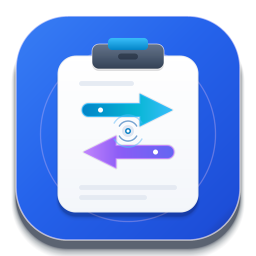

<p align="center">
  
</p>

# ClipRelay

Mac、Windows 与 Android 手机在同一局域网内互传文本和截图的小工具。选中或截图即发，对方直接粘贴。

- Mac 端基于 [Hammerspoon](https://www.hammerspoon.org/)，每台 Mac 一个 `init.lua`，无需构建。
- Windows 端基于系统自带的 PowerShell 5.1 和 .NET，无需安装第三方运行时。
- Android 端优先使用仓库维护的原生 APK；`android/` 目录仍保留 Termux 双向互传方案。

## 工作原理

- 每台设备运行一个 HTTP 服务（默认端口 `47632`）；文本使用 `POST /push`，JPEG 截图使用 `POST /push-image`。
- Mac 按下 `Ctrl+Alt+G` 后，脚本模拟 `Cmd+C` 获取选中文本、恢复原剪贴板，再发送给对端。
- Windows 直接监听普通的 `Ctrl+C`：当前应用照常完成复制，剪贴板更新后 ClipRelay 把新文本并行发送给所有启用的接收设备。
- Windows 按 `Ctrl+Alt+F12` 时，在内存中截取并编码所有显示器一次，再把同一份 JPEG 并行发送给所有启用设备；不打开截图界面、不写文件，也不改本机剪贴板。
- 对端收到后写入系统剪贴板并弹出通知，直接按 `Cmd+V` 或 `Ctrl+V` 即可粘贴。
- 各平台使用相同协议，可以任意互传；Windows 可维护最多 16 个广播目标，其他脚本端仍可通过 `PEER` 指定单个接收方。

## Mac 端

```bash
brew install --cask hammerspoon
mkdir -p ~/.hammerspoon
cp init.lua ~/.hammerspoon/init.lua
```

1. 打开 Hammerspoon，按提示授予「辅助功能」权限
   （系统设置 → 隐私与安全性 → 辅助功能）。
2. 编辑 `~/.hammerspoon/init.lua`，把顶部的 `PEER` 改成对端设备的局域网 IP 或 `.local`
   主机名。Mac 上可运行 `scutil --get LocalHostName`，假设输出
   `Alice-Mac`，则填写 `Alice-Mac.local`。也可以直接填写局域网 IP。
3. 点 Hammerspoon 菜单栏图标 → Reload Config，看到「ClipRelay 已启动」即就绪。

也可以使用一键安装脚本：

```bash
curl -fsSL https://raw.githubusercontent.com/ffffhx/cliprelay/main/mac-bootstrap.sh \
  | bash -s -- Alice-Mac.local
```

## Windows 端

支持 Windows 10/11，使用系统自带的 Windows PowerShell 5.1。安装脚本会：

- 把客户端和配置写入 `%LOCALAPPDATA%\ClipRelay`；
- 注册当前用户登录自启；
- 为监听端口添加仅限“专用网络”的入站防火墙规则；
- 安装后立即启动，系统托盘出现 ClipRelay 图标即表示运行中；
- 左键点击托盘图标可打开深色“设备链路”控制台，查看并一键复制本机主机名（`.local`）或局域网 IP；
- 控制台集中显示本机监听状态、文本/截图快捷键及冲突状态、广播链路和最近一次传输结果；
- “管理设备”支持添加、编辑、停用和移除最多 16 个目标，每台设备可单独配置名称、地址、端口和访问密钥；
- 支持修改本机监听端口、接收密钥、通知和开机自启，并可并行检测所有广播设备。

在仓库根目录打开 PowerShell，执行（把 IP 换成接收方设备的局域网 IP）：

```powershell
powershell.exe -NoProfile -ExecutionPolicy Bypass `
  -File .\windows\install.ps1 -Peer 192.168.1.100
```

也可以不克隆仓库，直接安装：

```powershell
$source = (Invoke-WebRequest -UseBasicParsing `
  "https://raw.githubusercontent.com/ffffhx/cliprelay/main/windows/install.ps1").Content
& ([scriptblock]::Create($source)) -Peer "192.168.1.100"
```

添加防火墙规则时会出现一次 UAC 确认。安装完成后，正常按 `Ctrl+C` 即会同时复制
到本机并广播；按 `Ctrl+Alt+F12` 会静默广播整个虚拟桌面的 JPEG 截图。接收的文本或
截图会进入剪贴板。局域网内建议优先使用 IP，避免
Windows 或 Android 环境无法解析 `.local`。

配置保存在 `%LOCALAPPDATA%\ClipRelay\config.json`。左键点击托盘图标，或右键选择
`设置 / 配置对方设备...`：在“这台电脑”中切换本机主机名 (`.local`) 与局域网 IPv4，点击 `复制` 后发给对方；
点击“管理设备”，为手机、另一台电脑等目标分别填写名称、局域网 IP/主机名、端口和访问密钥；点击 `检测全部` 会并行探测所有启用设备，且不会修改任何剪贴板。
广播时单台设备离线不会阻止其他设备接收；界面会显示“全部送达”“部分送达”或“全部失败”，并保留逐设备结果。
如果修改监听端口，ClipRelay 会申请更新专用网络防火墙规则并自动重启；这一步可能出现 UAC 确认。
设备列表中某个目标的访问密钥，需要与该目标自己的“接收密钥”一致；主窗口的“本机接收密钥”只保护发往这台 Windows 电脑的请求。留空则兼容未启用认证的旧客户端。
卸载命令：

```powershell
powershell.exe -NoProfile -ExecutionPolicy Bypass `
  -File "$env:LOCALAPPDATA\ClipRelay\uninstall.ps1"
```

如只想临时运行、不安装自启或防火墙规则：

```powershell
powershell.exe -NoProfile -STA -ExecutionPolicy Bypass `
  -File .\windows\cliprelay.ps1 -Peer 192.168.1.100
```

## Android 端（原生 APK，推荐）

原生工程位于 [`android-app/`](android-app/)，支持 Android 8.0 及以上版本。App 会运行一个
带常驻通知的前台接收服务，支持文本 `/push` 和截图 `/push-image`。收到内容后会：

- 将文本或截图写入手机系统剪贴板；
- 弹出可关闭内容预览的通知；
- 在 App 内保留最近 30 条文本与截图，点击进入无系统栏的沉浸式全屏，左右滑动切换；全屏图片支持 1×–5× 双指缩放与放大后拖动；轻点内容可显示复制、关闭及横竖屏控制；
- 根据设置在手机重启或 App 更新后恢复接收。

### 使用 APK

1. 安装由 GitHub Actions 产出的 `ClipRelay-android-debug` APK，或按下节自行构建。
2. 手机与电脑连接同一个可信局域网，打开 App，点击“开始接收”。
3. 按系统提示允许“本地网络”和通知权限。部分厂商还需把 ClipRelay 的电池策略改为“不受限制”。
4. App 会显示 `192.168.x.x:47632` 一类地址。点击“复制 IP”，在 Windows 托盘设置中打开“管理设备”，添加手机并填写该 IP；两边端口保持 `47632`。
5. 在电脑正常按 `Ctrl+C` 可发送文本；按 `Ctrl+Alt+F12` 可发送所有显示器的截图。收到的内容会直接进入手机剪贴板。

访问密钥默认为空。若在 Android 启用，Windows 的对应广播设备也要填写相同密钥，发送请求会携带
`X-ClipRelay-Token: <密钥>`；缺失或错误的密钥会收到 `401`。

### 本地构建

需要 JDK 17 和 Android SDK Platform 37。在 Windows PowerShell 中：

```powershell
cd android-app
.\gradlew.bat lintDebug testDebugUnitTest assembleDebug
adb install -r .\app\build\outputs\apk\debug\app-debug.apk
```

可安装的 Debug APK 位于 `android-app/app/build/outputs/apk/debug/app-debug.apk`。正式分发时
请使用自己的 Android 签名密钥构建并签名 Release APK；不要把签名文件提交到仓库。

### App 自动更新

正式版会在启动时检查更新，接收服务运行期间每 24 小时再检查一次。发现新版后，App 会显示
更新说明并下载 APK；下载完成后需要按 Android 系统提示确认安装。安装包必须满足以下条件才会
交给系统安装器：

- `versionCode` 高于当前版本；
- 包名仍为 `com.cliprelay.app`；
- APK 签名与已安装版本一致；
- 文件 SHA-256 与发布清单一致。

更新源默认是 GitHub 最新 Release 中的 `update.json`。推送形如 `android-v0.6.0` 的标签会触发
`.github/workflows/android-release.yml`，构建并发布签名 APK 和更新清单。仓库需要预先配置
`CLIPRELAY_KEYSTORE_BASE64`、`CLIPRELAY_STORE_PASSWORD`、`CLIPRELAY_KEY_ALIAS`、
`CLIPRELAY_KEY_PASSWORD` 四个 Actions Secrets；这些值必须始终对应首次正式安装使用的签名密钥。
发布前还要同步提高 `android-app/app/build.gradle.kts` 中的 `versionCode` 和 `versionName`，且标签必须
等于 `android-v<versionName>`。

OPPO、realme 等带厂商后台管理的手机，还需要在 ClipRelay 的“耗电管理”中开启“允许应用自启动”
和“允许完全后台行为”。否则厂商系统可能拦截 `MY_PACKAGE_REPLACED`，导致 App 更新后要手动打开一次
才能恢复接收。标准 Android 设备不需要额外设置。

Android 10 及以上版本不允许普通后台 App 持续读取其他 App 的剪贴板，因此 APK 当前聚焦于
稳定接收“电脑 → 手机”。如需“手机 → 电脑”，可继续使用下面的 Termux 小部件方案。

## Android 端（Termux 兼容方案）

需要三个 App（建议从 F-Droid 安装，Play 商店版本已停更）：

- **Termux**：跑脚本本体
- **Termux:API**：读写剪贴板、弹通知
- **Termux:Widget**（可选）：把"发送"做成桌面一键小部件
- **Termux:Boot**（可选）：开机自动启动接收端

在 Termux 里执行：

```bash
pkg install python curl jq termux-api
mkdir -p ~/cliprelay
# 把本仓库 android/receiver.py 和 android/send.sh 拷到 ~/cliprelay/
chmod +x ~/cliprelay/send.sh
# 编辑 send.sh 顶部的 PEER 为接收方设备的局域网 IP 或 .local 主机名
```

- **启动接收端**（收对端设备发来的文本，写剪贴板 + 通知）：

  ```bash
  termux-wake-lock
  python ~/cliprelay/receiver.py
  ```

- **发送**（把手机剪贴板推到 Mac）：

  ```bash
  ~/cliprelay/send.sh
  ```

  一键化：`mkdir -p ~/.shortcuts && cp ~/cliprelay/send.sh ~/.shortcuts/`，
  然后在桌面添加 Termux:Widget 小部件，点一下即发。

- **开机自启**（可选）：`mkdir -p ~/.termux/boot && cp android/boot-cliprelay.sh ~/.termux/boot/`

另：在系统设置里把 Termux 的电池优化关掉，否则后台会被杀。

## 配置项

Mac 配置位于 `init.lua` 顶部：

| 配置 | 默认值 | 说明 |
| --- | --- | --- |
| `PEER` | `peer-mac.local` | 对方设备的局域网 IP 或 `.local` 主机名 |
| `PORT` | `47632` | HTTP 服务端口，两边需一致 |
| `HOTKEY_MODS` / `HOTKEY_KEY` | `ctrl` `alt` + `g` | 全局热键，冲突可改 |

Windows 配置位于 `%LOCALAPPDATA%\ClipRelay\config.json`：

| 配置 | 默认值 | 说明 |
| --- | --- | --- |
| `peer` | 安装时的 `-Peer` | 兼容旧版本的首个启用目标地址；实际广播以 `peers` 为准 |
| `peers` | 从 `peer` 自动迁移 | 广播目标数组；每项包含 `name`、`address`、`port`、`accessToken` 和 `enabled` |
| `port` | `47632` | 本机接收服务端口 |
| `notifications` | `true` | 是否在收到文本时弹出系统气泡通知（设为 `false` 进入静默同步模式） |
| `accessToken` | 空 | 本机接收密钥；本机在非空时拒绝缺失或错误的 `X-ClipRelay-Token` |

Windows 当前监听不带其他修饰键的 `Ctrl+C`。按键不会被 ClipRelay 拦截，前台应用
仍按原方式完成复制；只有检测到剪贴板确实更新且内容为文本时才会发送。左键点击
托盘图标可打开设备链路控制台，配置广播设备、本机端口、本机接收密钥、开机自启和接收气泡通知（静默模式）；也可右键托盘图标快速切换通知状态或选择 `退出 ClipRelay`。
同一段文本在 1 秒内连续按普通 `Ctrl+C` 只发送一次；不同文本仍会立即逐条发送，发送失败也不会阻止下一次重试。
广播设备列表变化后，防抖签名也会随之变化；新增目标不会被上一条单设备发送记录误抑制。

截图快捷键固定为 `Ctrl+Alt+F12`。它会被注册为全局热键，不再传给前台应用。
ClipRelay 启动时会检测系统级热键冲突：
注册成功时托盘菜单显示“可用”；如果已被其他程序占用，托盘菜单显示冲突并弹出一次警告，
截图功能保持停用，但 `Ctrl+C` 文本同步和接收服务会继续运行。截图覆盖
整个 Windows 虚拟桌面（所有显示器），以质量 88 的 JPEG 在内存中只编码一次，再通过并行的 `/push-image`
请求广播；发送端不调用系统截图 UI、不写临时文件、不修改本机剪贴板，成功或失败也不会弹通知。
接收端会拒绝超过 25 MiB、格式错误或像素尺寸异常的图片。

## 注意

- 仅适用于可信内网：HTTP 为明文。访问密钥可以阻止未授权的 ClipRelay 请求，但不能加密文本或截图；密钥留空时，同网段其他设备可以往你的剪贴板推入文本或图片，也可能看到传输中的截图。
- Windows 端每次用 `Ctrl+C` 复制的文本都会自动发给配置的对端。复制密码、令牌等敏感
  内容前，请先从系统托盘退出 ClipRelay；鼠标右键菜单复制和 `Ctrl+Shift+C` 不会触发发送。
- Mac 之间可以使用 `.local` 主机名，避免 DHCP 导致 IP 变化。
- 部分 Windows/Android 环境无法稳定解析 `.local`，此时请使用局域网 IP，并在路由器中配置 DHCP 静态租约。
- 首次使用如 macOS 防火墙弹窗询问 Hammerspoon 是否接受传入连接，选择允许。
- Android 13 及以上版本可能显示系统自带的剪贴板浮层；应用无法可靠关闭这个系统提示。
- Windows 安装器创建的防火墙规则只允许“专用网络”；请勿为了使用本工具把公共网络改成专用网络。

## License

[MIT](LICENSE)
