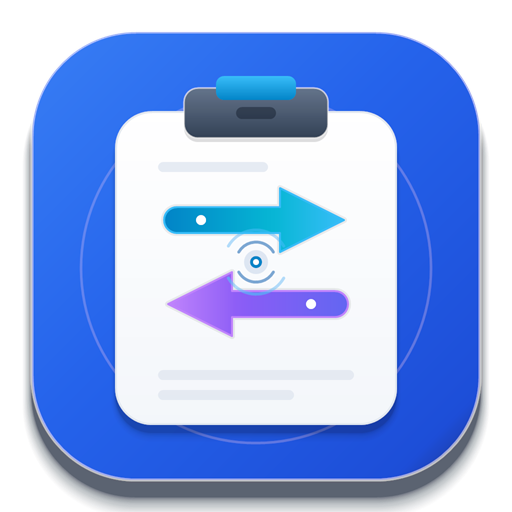

<p align="center">
  
</p>

# ClipRelay

Mac、Windows 与 Android 手机在同一局域网内互传文本和截图的小工具。选中或截图即发，对方直接粘贴。

- Mac 端基于 [Hammerspoon](https://www.hammerspoon.org/)，每台 Mac 一个 `init.lua`，无需构建。
- Windows 端基于系统自带的 PowerShell 5.1 和 .NET，无需安装第三方运行时。
- Android 端使用仓库维护的原生 APK，工程位于 `android-app/`，接收电脑发送的文本和截图。

## 工作原理

- 每台设备运行一个 HTTP 服务（默认端口 `47632`）；文本使用 `POST /push`，JPEG 截图使用 `POST /push-image`。
- Windows、Mac 和原生 Android 的接收服务启动后会通过 mDNS/DNS-SD 发布 `_cliprelay._tcp.local`；扫描端向局域网查询该服务，并从结果中取得设备名、地址、端口和是否需要访问密钥。
- Mac 按下 `Ctrl+Alt+G` 后，脚本模拟 `Cmd+C` 获取选中文本、恢复原剪贴板，再发送给对端。
- Windows 直接监听普通的 `Ctrl+C`：当前应用照常完成复制，ClipRelay 把新文本并行发送给所有启用的接收设备；若没有发生新复制，则发送剪贴板当前文本。
- Windows 按 `Ctrl+Alt+F12` 时，在内存中截取并编码所有显示器一次，再把同一份 JPEG 并行发送给所有启用设备；不打开截图界面、不写文件，也不改本机剪贴板。
- 对端收到后写入系统剪贴板并弹出通知，直接按 `Cmd+V` 或 `Ctrl+V` 即可粘贴。
- 各平台使用相同协议；Windows 和 Mac 支持发送与接收，Android 当前支持接收；Windows 可维护最多 16 个广播目标，Mac 可从菜单栏扫描并选择单个接收方，手动地址始终保留为回退方案。
- mDNS 声明包含随机设备 ID、显示名称、协议版本、平台、端口和认证状态，不包含访问密钥、剪贴板内容或历史记录。
- 原生 Android 默认使用“品牌 + 型号”作为发现名称（例如 `realme RMX5002` 或 `OnePlus PHK110`），并在 TXT 记录中分别声明 `brand` 和 `model`；设置页仍可覆盖成自定义名称。

## Mac 端

```bash
brew install --cask hammerspoon
mkdir -p ~/.hammerspoon
cp init.lua ~/.hammerspoon/init.lua
```

1. 打开 Hammerspoon，按提示授予「辅助功能」权限
   （系统设置 → 隐私与安全性 → 辅助功能）。
2. 默认可先保留顶部的 `DEFAULT_PEER`；启动后点击菜单栏的 `ClipRelay` → `扫描局域网设备…`
   选择对端。所选地址、端口和访问密钥会持久保存。mDNS 不可用时，再把 `DEFAULT_PEER`
   改为对端的局域网 IP 或 `.local` 主机名。
3. 点 Hammerspoon 菜单栏图标 → Reload Config，看到「ClipRelay 已启动」即就绪。

也可以使用一键安装脚本：

```bash
curl -fsSL https://raw.githubusercontent.com/ffffhx/cliprelay/main/mac-bootstrap.sh \
  | bash -s -- Alice-Mac.local
```

## Windows 端

支持 Windows 10/11，使用系统自带的 Windows PowerShell 5.1。安装脚本会：

- 把客户端和配置写入 `%LOCALAPPDATA%\ClipRelay`；
- 注册当前用户登录自启；
- 为监听端口添加仅限“专用网络”的入站防火墙规则；
- 安装后立即启动，系统托盘出现 ClipRelay 图标即表示运行中；
- 左键点击托盘图标可打开深色“设备链路”控制台，查看并一键复制本机主机名（`.local`）或局域网 IP；
- 控制台集中显示本机监听状态、文本/截图快捷键及冲突状态、广播链路和最近一次传输结果；
- 左侧设备列表可直接开关每台目标，通过 `···` 编辑或移除设备；支持添加和扫描最多 16 个目标，名称、地址、端口和访问密钥独立配置；全部关闭时暂停发送，本机仍可接收；
- 支持修改本机监听端口、接收密钥、通知和开机自启，并可并行检测所有广播设备。

在仓库根目录打开 PowerShell，执行（初始地址之后可由扫描结果替换）：

```powershell
powershell.exe -NoProfile -ExecutionPolicy Bypass `
  -File .\windows\install.ps1 -Peer 192.168.1.100
```

也可以不克隆仓库，直接安装：

```powershell
$source = (Invoke-WebRequest -UseBasicParsing `
  "https://raw.githubusercontent.com/ffffhx/cliprelay/main/windows/install.ps1").Content
& ([scriptblock]::Create($source)) -Peer "192.168.1.100"
```

添加防火墙规则时会出现一次 UAC 确认。安装完成后，正常按 `Ctrl+C` 即会同时复制
到本机并广播；按 `Ctrl+Alt+F12` 会静默广播整个虚拟桌面的 JPEG 截图。接收的文本或
截图会进入剪贴板。

配置保存在 `%LOCALAPPDATA%\ClipRelay\config.json`。左键点击托盘图标，或右键选择
`设置 / 配置对方设备...`：在“这台电脑”中切换本机主机名 (`.local`) 与局域网 IPv4，点击 `复制` 后发给对方；
左侧列表始终显示所有已保存设备，开关决定该设备是否接收广播，停用后仍留在列表中。点击 `+ 添加` 可手动添加，点击 `扫描添加设备` 可发现局域网目标并合并到列表；通过每行的 `··· → 编辑设备 / 移除设备` 管理名称、地址、端口和密钥，修改立即保存。检测连接只探测已启用设备，不会修改任何剪贴板。
“检测全链路连接”会先在后台扫描局域网，按设备 ID 更新已有目标的 IP 和端口并自动保存，再检测连接；不会自动新增目标，也不会改动名称、密钥或启用状态。未发现的设备仍按已保存地址检测，扫描失败时也会回退到已保存地址。
文本和截图发送遇到连接失败或超时时，会在允许局域网发现的情况下扫描一次（约 1.8 秒）；仅当同一设备 ID 的地址或端口发生变化时，保存新地址并重试一次。已成功设备不重发，密钥/HTTP 错误不重试；未发现新地址则保留失败结果。自动恢复要求设备已通过扫描关联到真实设备 ID，不能仅凭相同名称识别手动添加的设备。
在设置中可修改“局域网发现名称”或关闭“允许局域网发现”；这两项变化会在保存后重启后台服务。
广播时单台设备离线不会阻止其他设备接收；界面会显示“全部送达”“部分送达”或“全部失败”，并保留逐设备结果。
如果修改监听端口，ClipRelay 会申请更新专用网络防火墙规则并自动重启；这一步可能出现 UAC 确认。
设备列表中某个目标的访问密钥，需要与该目标自己的“接收密钥”一致；主窗口的“本机接收密钥”只保护发往这台 Windows 电脑的请求。留空则兼容未启用认证的旧客户端。
卸载命令：

```powershell
powershell.exe -NoProfile -ExecutionPolicy Bypass `
  -File "$env:LOCALAPPDATA\ClipRelay\uninstall.ps1"
```

如只想临时运行、不安装自启或防火墙规则：

```powershell
powershell.exe -NoProfile -STA -ExecutionPolicy Bypass `
  -File .\windows\cliprelay.ps1 -Peer 192.168.1.100
```

## Android 端（原生 APK）

原生工程位于 [`android-app/`](android-app/)，支持 Android 8.0 及以上版本。App 会运行一个
带常驻通知的前台接收服务，支持文本 `/push` 和截图 `/push-image`。收到内容后会：

- 将文本或截图写入手机系统剪贴板；
- 弹出可关闭内容预览的通知；
- 在 App 内保留最近 30 条文本与截图，点击进入无系统栏的沉浸式全屏，左右滑动切换；全屏图片支持 1×–5× 双指缩放与放大后拖动，拖到左右边缘后松手，再向外滑动可切换相邻的图片或文字；轻点内容可显示复制、关闭及横竖屏控制；
- 根据设置在手机重启或 App 更新后恢复接收。

文本全屏阅读默认渲染 Markdown，支持标题、列表、引用、表格、链接及带语法高亮的代码块。
预览保留原文中的单次换行，避免复制来的多行文字被合并为同一段连续文字。
独立段落间留一行空白；连续列表项紧凑排列，原文在列表项间留有空行时使用较大间距，嵌套列表分别判断。
预览字号旁可切换深色（黑底白字）和浅色（白底黑字），选择会保存，原文、Markdown、代码高亮和控制栏同步换色；设置页也可调整“预览暗黑模式”。
顶部可切换“查看原文 / Markdown 预览”，全文复制始终保留原始 Markdown；代码块支持横向滚动和“复制代码”。
轻点正文可显示或隐藏控制栏，字号调整、横竖屏和左右切换历史仍可使用。此功能渲染收到的文本，不涉及 `.md` 文件传输。
全屏控制栏直接覆盖正文，显示或隐藏时不改变正文位置。阅读期间收到新文本或图片时，会显示
“收到 N 条新内容 · 点击查看”，约 4.5 秒后收为“新内容 N”提示，直到点击查看或忽略；手动滑到新内容并停下时也会扣除对应提醒，全部看过后自动消失。不自动跳走当前阅读记录。

收到的图片可在历史卡片或全屏预览的控制栏点击“保存到相册”，原图会复制到 `Pictures/ClipRelay`，清空接收历史不会删除已保存的相册图片。Android 8–9 首次保存时需允许存储权限。
本次打开 App 期间，操作成功的内容会显示“已保存”或“已复制”，列表与全屏同步；切到后台或旋转屏幕保留状态，关闭 App 页面或结束进程后重新打开恢复默认文案。“已复制”仍可再次复制，“已保存”不重复写入相册。

### 使用 APK

1. 安装由 GitHub Actions 产出的 `ClipRelay-android-debug` APK，或按下节自行构建。
2. 手机与电脑连接同一个可信局域网，打开 App，点击“开始接收”。
3. 按系统提示允许“本地网络”和通知权限。部分厂商还需把 ClipRelay 的电池策略改为“不受限制”。
4. App 会显示 `192.168.x.x:47632` 一类地址，并在“允许局域网发现”开启时自动声明自己。在 Windows 托盘面板左侧点击“扫描添加设备”即可添加手机；扫描不到时仍可点击“+ 添加”手动填写 IP。
5. 在电脑正常按 `Ctrl+C` 可发送文本；按 `Ctrl+Alt+F12` 可发送所有显示器的截图。收到的内容会直接进入手机剪贴板。

访问密钥默认为空。若在 Android 启用，Windows 的对应广播设备也要填写相同密钥，发送请求会携带
`X-ClipRelay-Token: <密钥>`；缺失或错误的密钥会收到 `401`。

Android 0.10.11 起，可在接收设置中开启「调试时保持亮屏」（默认关闭）。接收服务运行时，只要系统的 USB 调试或 Wi-Fi 调试任一开启，就阻止自动息屏，包括未充电、切到其他 App 的情况；两项都关闭、关闭此选项或停止接收后恢复系统原有息屏规则，不修改原来的息屏时间。手动按电源键仍可锁屏。此功能依赖系统允许 App 读取调试开关，已在 Android 13 真机验证；部分较新系统可能限制读取。

### 本地构建

需要 JDK 17、Go 1.26.7、Android SDK Platform 37 和 NDK 29.0.14206865。远控客户端源码已内置于
`android-app/remote-engine/`，首次构建会同时编译原生解码/传输模块。在 Windows PowerShell 中：

```powershell
$env:ANDROID_HOME = "$env:LOCALAPPDATA\Android\Sdk"
python scripts/build_network.py android
cd android-app
.\gradlew.bat lintDebug testDebugUnitTest assembleDebug
adb install -r .\app\build\outputs\apk\debug\app-debug.apk
```

可安装的 Debug APK 位于 `android-app/app/build/outputs/apk/debug/app-debug.apk`。正式分发时
请使用自己的 Android 签名密钥构建并签名 Release APK；不要把签名文件提交到仓库。

已有正式版的真机可使用相同签名的 QA 构建运行 Markdown 界面测试：配置本地签名后，执行
`./gradlew connectedQaAndroidTest -PcliprelayTestBuildType=qa`。测试覆盖预览/原文切换、字号、代码复制、
横向滚动与横屏，并在 App 的外部文件目录保存 `markdown-*-qa.png` 截图；测试结束后安装正式 Release 包。
手动验收文本见 [`android-app/markdown-preview-demo.md`](android-app/markdown-preview-demo.md)。

### App 自动更新

正式版会在启动时检查更新，接收服务运行期间每 24 小时再检查一次。发现新版后，App 会显示
更新说明并下载 APK；下载完成后需要按 Android 系统提示确认安装。安装包必须满足以下条件才会
交给系统安装器：

- `versionCode` 高于当前版本；
- 包名仍为 `com.cliprelay.app`；
- APK 签名与已安装版本一致；
- 文件 SHA-256 与发布清单一致。

更新源默认是腾讯云 HTTPS 服务，版本清单和 APK 都从腾讯云下载，手机无需连接 GitHub。部署说明见
[`deploy/README.md`](deploy/README.md)。推送 `android-app/`、正式发布工作流或版本脚本的改动到 `main`
后，`.github/workflows/android-release.yml` 会自动运行测试、构建签名 APK、创建
`android-v<versionName>` 标签，并发布 APK 与更新清单。无需手动修改版本号：如果当前版本不高于
已发布版本，工作流会递增补丁号和 `versionCode`，验证构建成功后将版本修改提交回 `main`；
手动指定的更高版本号会保留。没有未发布的 Android 改动时，重复运行不会产生新版本。
发布任务串行执行，并取最新 `main`；构建期间分支有新提交时不会强推覆盖，后续任务会处理最新代码。
随后 Android Cloud Sync 会同步文件到腾讯云，并校验线上版本和 APK 哈希；失败时可单独重跑同步工作流。
手工推送形如 `android-v0.6.0` 的标签或从 Actions 手动运行工作流仍可作为发布兜底。
仓库需要预先配置
`CLIPRELAY_KEYSTORE_BASE64`、`CLIPRELAY_STORE_PASSWORD`、`CLIPRELAY_KEY_ALIAS`、
`CLIPRELAY_KEY_PASSWORD` 四个 Actions Secrets；这些值必须始终对应首次正式安装使用的签名密钥。
手工标签必须等于 `android-v<versionName>`，且指向本次构建的提交，否则发布工作流会直接失败。

OPPO、realme 等带厂商后台管理的手机，还需要在 ClipRelay 的“耗电管理”中开启“允许应用自启动”
和“允许完全后台行为”。否则厂商系统可能拦截 `MY_PACKAGE_REPLACED`，导致 App 更新后要手动打开一次
才能恢复接收。标准 Android 设备不需要额外设置。

Android APK 当前支持接收电脑发送的文本和截图，尚未提供“手机 → 电脑”的发送功能。

## 配置项

Mac 配置位于 `init.lua` 顶部：

| 配置 | 默认值 | 说明 |
| --- | --- | --- |
| `DEFAULT_PEER` | `peer-mac.local` | 尚未扫描选择设备时使用的手动回退地址 |
| `LOCAL_PORT` | `47632` | 本机 HTTP 接收服务和 mDNS 声明端口 |
| `HOTKEY_MODS` / `HOTKEY_KEY` | `ctrl` `alt` + `g` | 全局热键，冲突可改 |

Mac 扫描选择的 `peer`、`peerPort`、`peerToken`，以及稳定的 `deviceId` 和发现开关保存在 Hammerspoon 的 `hs.settings` 中。

Windows 配置位于 `%LOCALAPPDATA%\ClipRelay\config.json`：

| 配置 | 默认值 | 说明 |
| --- | --- | --- |
| `peer` | 安装时的 `-Peer` | 兼容旧版本的首个启用目标地址；实际广播以 `peers` 为准 |
| `peers` | 从 `peer` 自动迁移 | 广播目标数组；手动项包含名称、地址、端口、访问密钥和启用状态，扫描项还会保存设备 ID、平台和认证状态 |
| `port` | `47632` | 本机接收服务端口 |
| `notifications` | `true` | 是否在收到文本时弹出系统气泡通知（设为 `false` 进入静默同步模式） |
| `accessToken` | 空 | 本机接收密钥；本机在非空时拒绝缺失或错误的 `X-ClipRelay-Token` |
| `deviceId` | 首次安装生成的 UUID | 用于扫描去重和排除本机，不随设备名称或 IP 改变 |
| `deviceName` | Windows 计算机名 | mDNS 中显示的发现名称 |
| `discoveryEnabled` | `true` | 是否通过 mDNS 向当前局域网声明本机 ClipRelay 服务 |

Windows 当前监听不带其他修饰键的 `Ctrl+C`。按键不会被 ClipRelay 拦截，前台应用
仍按原方式完成复制；剪贴板更新后发送新文本，等待约 300 毫秒仍未更新时发送剪贴板当前文本。
剪贴板为空或只有图片、文件等非文本内容时不发送。可以先点击网页的“复制”按钮，再在没有选中文本的位置按 `Ctrl+C` 发送；
若当前应用把 `Ctrl+C` 解释为复制整行等操作，则发送该操作产生的新文本。左键点击
托盘图标可打开设备链路控制台，配置广播设备、本机端口、本机接收密钥、开机自启和接收气泡通知（静默模式）；也可右键托盘图标快速切换通知状态或选择 `退出 ClipRelay`。
同一段文本在 1 秒内连续按普通 `Ctrl+C` 只发送一次；不同文本仍会立即逐条发送，发送失败也不会阻止下一次重试。
广播设备列表变化后，防抖签名也会随之变化；新增目标不会被上一条单设备发送记录误抑制。

截图快捷键固定为 `Ctrl+Alt+F12`。它会被注册为全局热键，不再传给前台应用。
ClipRelay 启动时会检测系统级热键冲突：
注册成功时托盘菜单显示“可用”；如果已被其他程序占用，托盘菜单显示冲突并弹出一次警告，
截图功能保持停用，但 `Ctrl+C` 文本同步和接收服务会继续运行。截图覆盖
整个 Windows 虚拟桌面（所有显示器），以质量 88 的 JPEG 在内存中只编码一次，再通过并行的 `/push-image`
请求广播；发送端不调用系统截图 UI、不写临时文件、不修改本机剪贴板，成功或失败也不会弹通知。
接收端会拒绝超过 25 MiB、格式错误或像素尺寸异常的图片。

## Windows 版本更新

首次安装可直接[下载 Windows v0.1.0 安装包](https://124-221-36-36.anyip.dev:8443/cliprelay/windows/ClipRelay-Windows-0.1.0.zip)，
解压整个文件夹后双击 `Install.cmd`。这个版本已经包含下面的更新提醒功能。

Windows 控制中心右下角和托盘菜单都有「版本更新」入口。客户端启动 10 秒后检查新版，
运行中每 15 分钟再检查一次；不要求朋友与你在同一局域网。发现新版后显示系统通知，
控制中心保留新版入口。同一版本只通知一次，更新通知可以单独关闭，不受剪贴板气泡开关影响。
系统专注模式可能隐藏气泡，仍可从控制中心查看。

更新窗口展示当前版本、新版本和本次更新说明，点击「下载新版」后在后台下载并校验 SHA-256
和文件大小。关闭更新窗口不会中断下载；下载完成后点击「打开下载位置」，解压 ZIP，再双击
`Install.cmd` 安装。设备列表、访问密钥、本机端口及开机启动选择会保留。
不会自动安装或在共享屏幕时强制重启。首次安装的朋友可在控制中心添加或扫描设备。

Windows 更新源：`https://124-221-36-36.anyip.dev:8443/cliprelay/windows/update.json`。
发布者修改 [`windows/version.json`](windows/version.json) 和
[`windows/release-notes.txt`](windows/release-notes.txt)，提交后运行 GitHub Actions 的
`Windows Release`，或者推送 `windows-vX.Y.Z` 标签，即可构建安装包、发布更新说明并同步到云端。
发布流程见 [`deploy/README.md`](deploy/README.md#Windows-发布)。
旧版 Windows 客户端没有更新检查功能，需要先安装一次带这个功能的版本。

## 手机远程操作电脑

Windows 安装包内置远控引擎；Android APK 内置客户端。双方只需安装 ClipRelay，
不用单独安装 Sunshine、Moonlight 或 Tailscale，也不需要注册 Tailscale 账号。
内置外网连接优先尝试设备直连，无法直连时使用 ClipRelay 服务器中转；手机可以使用移动网络。

1. 电脑运行 ClipRelay 安装程序，允许安装 `ClipRelay Remote Desktop` 后台服务。
2. 打开电脑 ClipRelay 的「手机远控」，点击「开启远控」。首次安装默认关闭。
3. 手机和电脑连接同一局域网，手机首页点击「连接电脑」，电脑会自动出现在列表中，点选即可发起配对。
4. 核对手机和电脑显示的确认标识，在电脑「手机远控」中允许一次即可，不需要手填 IP 或 PIN。旧版电脑继续使用四位 PIN。
5. Android 0.10.17 起，点击「连接这台电脑」后直接进入画面，首次配对完成也会自动连接；已有串流时自动恢复，无需再打开连接选项或点击恢复串流。电脑有其他游戏串流时会恢复该串流，不会将其关闭。Android 0.10.13 起，横屏时如果桌面画面两侧留有足够宽的黑边，操作按钮会自动常驻在左右黑边中，无需收起或展开；按钮较多时可在侧栏内上下滑动，中央桌面画面保持原来的大小。侧栏避开屏幕缺口、系统栏与手机键盘。没有足够黑边时，仍可点右侧边缘的半透明「⋯」展开底部工具栏，小圆点可上下拖动并记住位置。
   工具栏中的「触控」可选择手机触控、直接点击或触控板，选择会保存到下次连接，也可在「画质与操控 → 触控方式」中修改。
   Android 0.10.19 起，展开工具栏点「返回电脑列表」（游戏模式在右上角菜单中），或使用系统返回，直接回到带「重新扫描」「其他添加方式」的电脑列表，不再弹出画中画小窗。返回时停止手机端画面接收并释放键鼠控制，电脑上的应用和会话保留；再次点击这台电脑即可恢复控制。键盘打开时，系统返回仍先收起键盘。

Android 0.10.12 / Windows 0.3.4 起，局域网发现同时使用 ClipRelay mDNS 和 UDP `47634` 查询，后者绑定 Wi-Fi / 有线网卡以兼容手机开启 VPN 的情况；只返回设备名和服务端口，不广播凭据。首次授权通过独立的 TLS `48792` 通道，两端确认标识绑定电脑证书、手机证书和随机数，电脑通过本机受保护的控制接口允许后才提交远控配对。等待两分钟自动过期，手机可以取消。配对证书立即保存，重启保留；重新发现按远控 UUID 合并地址并核对保存的证书，IP 变化不会新增重复电脑或重置配对。手动 IP 和外网配对码在「其他添加方式」中。

需要从外网连接时：电脑「手机远控 → 外网配对」开启内置通道并生成八位配对码；
手机「连接电脑 → 其他添加方式 → 用配对码添加」输入该码。核对两边显示的六位标识，在电脑允许这台手机，
待手机显示就绪后点击「连接电脑」。如果此前已在局域网完成配对，外网连接会沿用授权；仅通过外网首次配对时，仍需在电脑端输入手机显示的四位 PIN。
配对码五分钟有效、只能使用一次。之后打开电脑列表即自动恢复已启用的通道，并按电脑身份合并局域网和安全通道地址，不需要选择内外网模式。

Android 0.10.8 起，内置通道会自动重建异常退出的 UDP 转发端口，避免电脑仍显示在线但实时控制无法握手；恢复期间显示「正在恢复串流通道」。内置通道连接失败时提供重试提示，不再显示原引擎不适用的公网 47999 端口建议。
Android 0.10.6 起并行探测保存的地址，优先选局域网；内置通道已响应时，最多额外等待 400 毫秒争取更优先的路径，避免失效的旧地址拖住连接。每条路径仍核对电脑身份并使用已保存的配对证书。此选择发生在连接前；串流中换网可能仍需重新连接。
手机「暂停安全通道」会保留配对且仍可局域网直连；电脑可分别关闭外网连接、撤销外网配对或撤销远控授权。
当前手机端保存一台电脑的外网配对，电脑最多允许八台手机；一个手机发起新的外网配对会替换它的旧连接。
此版本内置外网通道用于手机远控；剪贴板同步和电脑之间的屏幕共享仍使用原有设备地址与访问密钥。

设备密钥保存在各端私有目录中，Android 的设备凭据由系统 Keystore 加密并排除备份。
配对与协调服务部署在现有腾讯云更新服务器上，设备之间使用 WireGuard 加密。
不同电脑的配对组由服务端访问规则隔离，电脑还会检查手机地址白名单；公网不开放远控管理接口。
中转会消耗服务器带宽，适合个人使用的容量需按实际串流码率规划；直连画面不经过服务器。

「手机触控」将手指操作作为真实触屏输入传给电脑：点按、单指滑动滚动、双指捏合缩放和长按菜单由电脑软件处理。
Orca 开发工具使用滚动兼容：单指滑动转换为鼠标滚轮，手指上滑让内容上移，下滑查看上方内容；不会同时发送拖拽或误点。轻点仍点击，长按为右键；双指恢复原生触屏手势，效果仍取决于软件支持。自动识别到 Orca 或手动选择 Orca 模式时启用。
滚动、缩放和选字效果取决于软件的触屏支持，电脑界面不会变成手机版。「手机触控」点进可编辑输入框后会自动弹出手机键盘，点到普通按钮或只读区域后收起自动打开的键盘；手动收起后不会反复弹出。
自动键盘需要新版 Windows 端和 Android 端。自绘控件、部分游戏或旧版电脑端可能无法提供输入焦点，此时仍可从工具栏打开「手机键盘」。
如果手机连接了实体键盘，或 scrcpy 使用了键盘模拟，Android 可能禁止显示手机键盘。请在手机系统「实体键盘」设置中开启「使用屏幕键盘」。Android 0.10.5 同时修复了前台应用识别更新时取消刚刚点击后的键盘检测的问题；手动收起、切后台与断开连接仍会取消检测。
电脑通过 Windows UI Automation 核对轻点位置是否命中当前可编辑输入框，不读取文字、控件名称或密码。切换会话后自动获得焦点、点击空白处仍保留输入焦点，都不会自动弹出手机键盘；重新点击输入框才会唤起。此判断需要新版电脑端和手机端，旧版电脑端保留手动键盘入口。焦点通道使用现有远控配对证书进行双向 TLS 验证，撤销配对后立即停止访问。
拖动窗口、精确选字或操作老软件时可以切回「直接点击」「触控板」。不支持触屏输入的电脑会提示并切换为直接点击。
手机触控中的三指手势也传给电脑，不使用旧模式的三指唤起键盘；切换模式、失焦、旋转及断开连接会取消触点。

默认自动识别电脑前台应用，约 1–2 秒稳定后切换：星露谷物语（含 SMAPI）和速速上菜进入对应游戏按键，Orca 开发工具与 ChatGPT 使用各自桌面工具栏，其他应用返回通用桌面。只传输预设应用标识，不读取或传输窗口标题、应用路径及内容；沿用远控配对加密通道。旧版电脑或识别失败时保留当前布局。
展开桌面工具栏后，可通过应用模式按钮手动切换到 ChatGPT 或 Orca；手动选择应用、游戏或返回桌面会关闭自动切换，选择「自动识别电脑当前应用」可恢复（游戏选择窗口也有此入口）。两个桌面模式提供 Enter、Shift+Enter 换行、复制、粘贴、全选、撤销、重做和上下滚动；Orca 另有 Shift+Tab。模式切换释放旧按键和触点，不会启动应用或向应用发送文字。
复制、粘贴操作的是电脑剪贴板；滚动作用于电脑鼠标所在区域。

「虚拟键盘」在手机底部展开电脑按键，提供字母、数字、Ctrl、Alt、Shift、Win、Tab、Enter、退格、空格与方向键；「功能 / 符号」页包含 F1–F12、Esc、Delete、Insert、Home、End、Page Up/Down 和标点。先点亮修饰键，再点其他键发送组合（例如 Ctrl → C、Ctrl → Shift → Esc）；组合完成自动松开，再点同一个修饰键可取消选择，长按修饰键则单独发送该键。选中的修饰键仅用于下一次虚拟键盘按键，不用于电脑画面上的鼠标点击。
点击「收起」或手机返回键关闭面板；「手机键盘」保留系统输入法，适合输入中文。游戏模式可从右上角「⋯ → 虚拟键盘」打开，收起后恢复游戏按键。失焦、断开、切换应用、旋转和关闭面板会清除未发送的组合键，键盘区域不会把触摸传给电脑画面。

先点选电脑上 Orca、ChatGPT 或其他支持图片粘贴的软件输入区，再点远控工具栏的「传图片」，会直接打开手机系统相册选择器。选好后通过现有配对加密通道上传，自动返回串流并执行一次 Ctrl+V，无需再次确认上传或手动粘贴，也不会自动按回车发送消息。取消选图会直接返回；上传失败可重试，不会触发粘贴。选择器仅授权选中的图片，不需要读取整个相册。支持手机可解码的常见图片，源文件上限 20 MB；大图适度缩小后转为 PNG，保留透明通道并去除源元数据，传输上限 8 MB。自动上传及粘贴需要 Windows 0.3.3、Android 0.10.10 或更高版本；选图期间暂停串流，电脑应用继续运行。

在工具栏点击「应用 → 游戏模式」，先选择《速速上菜》或《星露谷物语》，再显示相应触屏方向控制和游戏按钮；游戏模式不再单独占用工具栏按钮。取消选择保留当前模式，右上角「⋯」菜单中的「切换游戏」可重新选择，并记住上次使用的游戏。《速速上菜》的键盘预设为：
WASD 移动、P 拿放、O 操作、K 准备，另有 Enter 确认和 Esc 暂停。
方向支持斜向移动，按钮支持长按，可多指同时操作；游戏仍在电脑上运行。
《星露谷物语》采用电脑默认键位：WASD 移动、C 使用工具、X 互动、E 背包、Tab 切换工具栏、Esc 暂停；顶部可直接选择 1–12 号物品格，菜单中有 F 任务日志和 M 地图。需要操作背包、商店或对话选项时，点「菜单触控」临时改为直接点击画面；点「返回按键」继续移动与工具操作。
右上角半透明「⋯」菜单可打开按键设置、暂停或返回桌面模式；点击菜单外可收起。
「按键设置」可以改键、调整按钮大小与不透明度、交换左右布局，两个游戏分别保存设置，重置仅影响当前游戏，升级保留原有速速上菜设置。
按键需要与电脑游戏内的设置一致。切换游戏、进入菜单触控、退出游戏模式、打开设置、失去焦点或断开连接时会释放已按住的键。
游戏按键模式中空白区域不会发送鼠标点击；菜单触控和返回桌面时可操作电脑画面，退出菜单触控后恢复之前的桌面触控方式。

电脑可以撤销手机授权、断开当前远控或关闭引擎。授权保存在后台服务的数据目录中，
安装升级会保留；卸载会删除服务及配对数据。桌面画面和键鼠消息由独立引擎处理。

后台服务安装于 `%ProgramFiles%\ClipRelay\Remote`，状态与密钥保存在
`%ProgramData%\ClipRelay\Remote`，仅 SYSTEM 与管理员可写。ClipRelay 设置界面通过仅限本机、
受 Windows 用户权限约束的命名管道管理服务；管理密码不会传给手机。
引擎管理接口仅允许本机访问，远控防火墙规则限于本地子网和 Tailscale 地址段。

Windows 离线包由 `scripts/package_windows.ps1` 生成，包含引擎、服务及内置网络组件。
源码构建需要 Go 1.26.7：先运行 `python scripts/build_network.py windows`，再运行
`windows/remote-desktop/setup.ps1`；安装服务加 `-Install`（管理员）。
Android 构建前运行 `python scripts/build_network.py android`，需要 JDK 17、Android SDK 和 NDK 29.0.14206865；
默认包含四种 ABI，真机调试可加 `--android-arch android/arm64`。生成的 AAR 不提交到源码库。
Go 依赖与 gomobile 版本已锁定，构建脚本会同时收集开源许可，Android 与 Windows 发布流程均包含这一步。
服务端使用 Headscale 0.29.4 和 ClipRelay 配对服务，配置、systemd 服务与安装脚本位于 `network/deploy/`；
运行 `python scripts/build_network.py server` 可构建 Linux amd64 配对服务。
公网服务器需允许 HTTPS 8443/TCP 与 STUN 3478/UDP；Windows 安装程序会添加仅限内置网络程序的 UDP 入站规则，
默认优先使用 47633 作为加密直连端口。应用不会添加系统 VPN、修改系统路由或接管其他应用流量。

Android 0.10.20 起，「画质与操控 → 自动调节码率」默认全自动：隐藏手动码率滑块，忽略旧的手动上限，按所选分辨率和帧率生成起始预算与内部质量范围。系统允许在起始预算的两倍以内探升（最高 150 Mbps），这只是内部保护范围，不代表实测带宽。客户端根据持续丢帧或有视频负载时相对基线持续增长的延迟降低预算；只有视频实际使用了足够预算、延迟正常且稳定约 3 分钟，才小幅提高预算，用真实视频试探带宽。静止桌面、短暂大帧、过期统计或无数据不会触发提速；探升需在真实负载下验证，失败后回退并退避至少 10 分钟。默认可降到 1 Mbps（更低的起始预算保持更低），两次降低至少相隔 30 秒。关闭自动调节才显示原来的手动码率，保存值不会被自动调整覆盖。当前内置引擎只在建立连接时协商码率，因此调整会短暂重连；分辨率、帧率、电脑应用、游戏模式、触控方式及工具栏状态保留。退出或连接失败时不会循环自动重试。

「移动网络自动省流」也默认开启：根据 Android 当前默认网络识别移动数据或计费网络（包括被系统标为计费的热点），采用最高 6 Mbps 的省流预算；普通 Wi-Fi / 非计费网络恢复按分辨率和帧率生成的正常预算。手动模式下低于 6 Mbps 的设置仍有效，不修改保存的分辨率、帧率或码率偏好。省流限制独立于拥堵调节开关，自动探升也不会突破省流预算；两项均关闭时按手动码率串流。启动时暂时无法识别网络则先采用省流预算，切网期间未知状态不会解除已有的限制。VPN 按系统报告的底层传输类型及计费属性判断，内置外网通道本身不代表正在使用移动数据。自动模式下即使关闭省流也会监测网络类型变化、丢弃旧路径上的拥堵判断。切网后会重新探测已配对电脑的可用地址，并短暂重连；小窗串流同样受省流限制。

当前电脑端引擎包面向 Windows x64。手机可在远控设置中选择分辨率、帧率、自动码率和音频选项；
实际流畅度取决于硬件编码器、手机解码能力和网络。手机端「帮助 → 开源许可」可离线查看组件许可。
侧栏和游戏菜单中的「传输信息」每秒显示实际分辨率、编码、视频接收码率、接收/显示帧率、网络丢帧与往返延迟，同时列出目标帧率、自动/手动模式、当前编码预算及省流状态，不再并列展示目标码率和码率上限。实测码率仅统计收到的视频，不含音频和网络开销；编码预算无需用满，静止画面的实际传输量可以很低。超过三秒没有新统计时提示暂无实时数据，关闭面板停止界面刷新。
无人值守服务会跟随当前 Windows 控制台会话启动并恢复引擎，但电脑仍需开机且有可捕获的显示器；
锁屏、UAC 安全桌面、拔掉显示器及重启后的登录界面需要在目标设备上另行验证。

发布版真机冒烟检查使用平台原生测试入口，保留正式 APK 的 R8 裁剪：

```powershell
cd android-app
.\gradlew.bat :app:assembleRelease :app:assembleReleaseAndroidTest -PcliprelayTestBuildType=release
adb install -r app/build/outputs/apk/release/app-release.apk
adb install -r -t app/build/outputs/apk/androidTest/release/app-release-androidTest.apk
adb shell am instrument -w com.cliprelay.app.test/com.cliprelay.app.RemoteDesktopSmokeInstrumentation
```

加 `-e connectionUi true` 可检查地址校验、重复提交、取消连接和请求中离开页面。
游戏触控回归测试 `GameControlsTouchTest` 使用 `qa` 构建与模拟按键接收端，
覆盖多指、长按、中断松键及改键保存，不会向电脑发送输入。
`ApplicationControlsTest` 检查多行文字、Unicode、显式提交和游戏默认键位；`ApplicationControlsUiTest` 使用 `qa` 构建检查应用草稿隔离、断线保护、游戏设置隔离、模式切换松键和菜单触控防误触，同样不会向电脑发送输入。
`VirtualKeyboardTest` 检查组合键顺序、Win 修饰标志、用后松键和断线清理；`ApplicationControlsUiTest` 同时覆盖虚拟键盘打开、翻页、组合键、收起、游戏入口和断线保护。
手机触控测试 `PhoneTouchTest` 同样使用模拟接收端，覆盖多指捏合、触点顺序变化、取消手势、黑边误触、模式切换及偏好保存。
`NativeTouchStateTest` 检查传输失败、触点释放和取消后的残余事件。
`AdaptiveBitrateControllerTest` 覆盖静止画面不探升、持续负载探升、短暂抖动、持续拥堵、延迟基线与排队、最低码率、冷却、恢复及回升失败后的退避。`CellularDataPolicyTest` 也验证自动模式忽略历史手动值、不同画质的预算范围、手动模式恢复及省流范围。
`CellularDataPolicyTest` 覆盖省流上限、未知网络、恢复原设置、较低手动上限、拥堵调节的配合，以及移动数据、Wi-Fi、计费热点和 VPN 的网络属性分类。`CellularDataSaverLiveTest` 需通过 USB 调试并显式传入 `-e liveDataSaver true`，会切换真实 Wi-Fi / 移动数据，检查实际协商码率、局域网与内置通道路由切换、小窗恢复及保存设置未变，最后恢复测试前的 Wi-Fi 状态和偏好，不发送电脑输入。
`AdaptiveBitrateLiveTest` 使用 `qa` 构建，必须显式传入 `-e liveAdaptive true -e hostName "已配对的电脑名称"` 才执行；通过注入网络统计验证真实重连、码率变化、操控状态保留与退出取消，不发送电脑键鼠输入，也不修改实际网络。默认测试运行会跳过这项实机检查。
电脑触屏测试窗口 `windows/tests/remote-phone-touch.ps1` 为普通小窗口，默认 20 秒关闭；
用于检查点按、单指滚动和长按菜单，必须先获得焦点，失去焦点后中止操作。

`windows/tests/remote-desktop-live.ps1` 检查后台接口与安装权限；`-Recovery` 仅用于尚未配对的测试主机。
键鼠测试窗口 `windows/tests/remote-desktop-target.ps1` 为普通非置顶窗口，默认 60 秒退出；
获得前台焦点后如果失去焦点，会立即关闭并请求断开远控。真机输入测试时仍需短暂停止本机键鼠操作。
该脚本校验固定版本引擎的 SHA-256，不运行第三方安装程序。

锁屏、UAC、安全桌面和关闭显示器后的行为取决于 Windows 会话、显卡及显示输出；
需要在目标设备上专项验证。服务自启不等于能自动唤醒关机或休眠中的电脑。

## Windows 之间实时屏幕共享

两台 Windows 电脑更新后，在发送方控制中心顶部点击「屏幕共享」，或在托盘菜单选择「屏幕共享 · 实时视频」，
选择接收电脑并点击「开始共享」，直接共享 Windows 主显示器的完整画面，无需再选择屏幕或窗口。
接收方点击「接受并观看」后播放实时画面，支持全屏。多显示器时共享主显示器，不拼接所有显示器。
屏幕共享可以单独选择已添加的 Windows 电脑，不要求开启该设备的剪贴板广播开关。
发送方在后台共享，不弹出状态窗口、不占用任务栏；右键 ClipRelay 托盘图标可查看等待接收、正在共享等状态，并选择「停止所有屏幕共享」。
主界面顶部会显示「发送邀请中 → 待接收 → 正在连接 → 正在共享」，可直接取消邀请或结束共享；超时或失败时保留原因并提供重新共享入口。同一台电脑的未结束邀请不会重复发送。
接收方关闭观看窗口或点击结束，也会停止本次共享。拒绝邀请、连接超时和异常断线会自动结束采集。

视频使用 WebRTC，目标 30 fps、最高 8 Mbps，随网络和设备性能调整；不写入剪贴板或历史记录。
目前面向同一局域网的 Windows 电脑，不包含音频或远程键鼠控制。无需云端账号。
共享邀请沿用设备访问令牌，连接协商复用 ClipRelay 的 TCP 端口，视频通过 WebRTC 的动态端口传输。
对方旧版本会提示需要更新。断线后会结束会话，恢复网络后可重新发起。

安装脚本会安装固定版本的 Electron 视频引擎并核验下载校验值；离线包包含引擎时直接使用包内文件。
实现与开源调研见 [screen-share/RESEARCH.md](windows/screen-share/RESEARCH.md)。

## 电脑遥控手机翻页

手机进入历史记录的全屏预览后，点击 Windows 主窗口右上方的「手机翻页」，或在托盘图标右键菜单选择「手机翻页」，
选择手机，再点击「上一页 / 下一页」或在遥控窗口内按 `←` / `→`。手机的剪贴板广播开关不影响遥控。
遥控窗口显示手机实际的「当前页 / 总页数」和内容类型；手机手动滑动也会同步，每约 0.6 秒刷新一次。
电脑端按内容时间翻页：「上一页 / ←」查看更早内容（页码增大），「下一页 / →」查看更新内容（页码减小，例如第 2 页到第 1 页）。到最新内容时禁用「下一页」，到最早内容时禁用「上一页」；首尾不循环，文本和图片都支持。
手机切到后台或退出全屏后停止接收遥控，电脑清空页码并提示打开预览；重新打开不会补执行旧指令。
实时页码需要电脑端和手机端同时更新；旧版手机仍可翻页，窗口会提示更新手机端。请求只发送给所选设备，沿用设备的访问令牌。

协议为 `POST /preview/navigate`，JSON 为 `{"direction":"previous"}` 或 `{"direction":"next"}`。
协议方向沿用页码顺序：`previous` 减小页码，`next` 增大页码；Windows 将按时间定义的按钮方向映射到该协议。
`200` 表示指令已入队，`409` 表示手机不在前台全屏预览或队列已满；认证规则与 `/push` 相同。
`POST /preview/state`（JSON `{}`）返回实际阅读状态，例如 `{"active":true,"page":2,"pageCount":8,"contentType":"text","moving":false}`。
页码从 1 开始，类型为 `text` 或 `image`，`moving` 表示翻页动画进行中；未打开前台全屏预览时返回 `active:false`、页码及总数为 `0`、类型为 `null`。
状态接口同样需要设备认证，不返回剪贴板正文或图片内容；退出遥控窗口后停止查询。

## 注意

- 仅适用于可信内网：HTTP 为明文。访问密钥可以阻止未授权的 ClipRelay 请求，但不能加密文本或截图；密钥留空时，同网段其他设备可以往你的剪贴板推入文本或图片，也可能看到传输中的截图。
- Windows 端每次用 `Ctrl+C` 复制的文本都会自动发给配置的对端。复制密码、令牌等敏感
  内容前，请先从系统托盘退出 ClipRelay；鼠标右键菜单复制和 `Ctrl+Shift+C` 不会触发发送。
- Mac 之间可以使用 `.local` 主机名，避免 DHCP 导致 IP 变化。
- 部分 Windows/Android 环境无法稳定解析 `.local`，此时请使用局域网 IP，并在路由器中配置 DHCP 静态租约。
- mDNS 标准使用 `224.0.0.251:5353`（IPv4）或 `ff02::fb:5353`（IPv6）组播，只在当前链路内工作；ClipRelay 当前从发现结果中选择 IPv4 作为发送地址。访客 Wi-Fi、AP 隔离、部分 VPN、防火墙或路由器的组播过滤会导致扫描不到；这不影响按 IP 手动配置。
- 首次使用如 macOS 防火墙弹窗询问 Hammerspoon 是否接受传入连接，选择允许。
- Android 13 及以上版本可能显示系统自带的剪贴板浮层；应用无法可靠关闭这个系统提示。
- Windows 安装器创建的防火墙规则只允许“专用网络”；请勿为了使用本工具把公共网络改成专用网络。

## License

原有 ClipRelay 源码采用 [MIT](LICENSE)。新增远控组件使用 GPLv3：
[客户端许可](android-app/remote-engine/COPYING)、[组件说明](android-app/remote-engine/NOTICE.txt)、
[电脑引擎许可](windows/remote-desktop/COPYING)。内嵌 Moonlight 后的 Android 组合程序按 GPLv3
要求发布，并提供完整对应源码与构建说明。Windows 包中的第三方引擎同样需要履行其 GPLv3
义务；源码版本见 `windows/remote-desktop/engine.json`。其他依赖保留各自许可。
